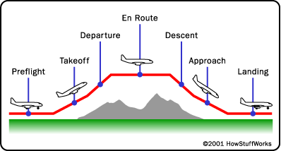
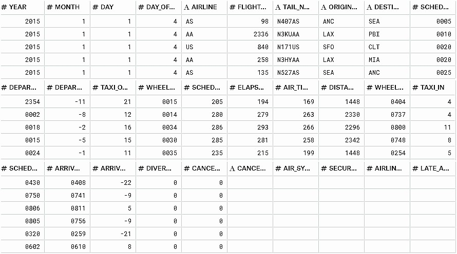
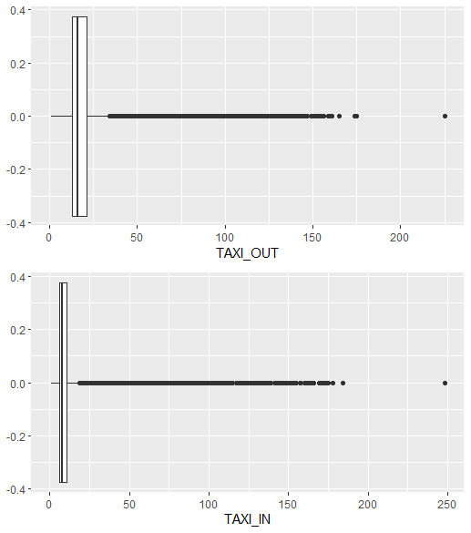
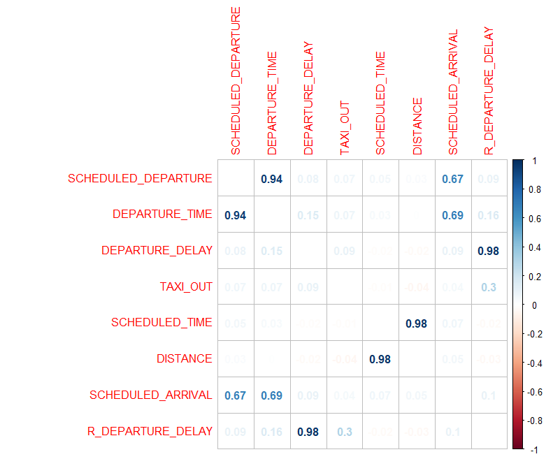
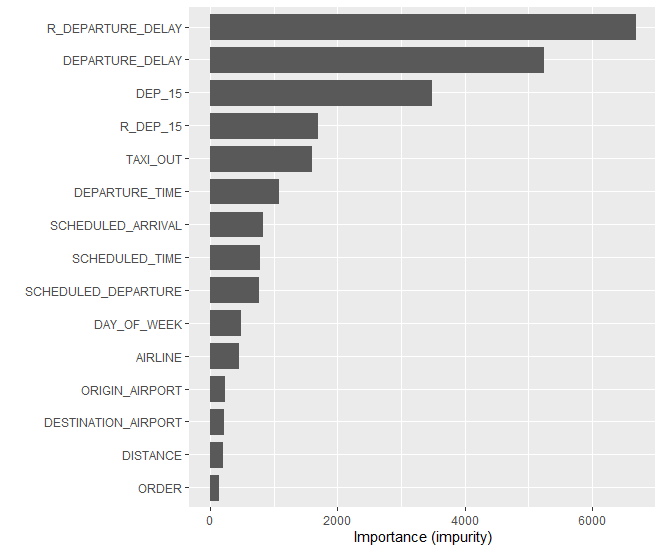
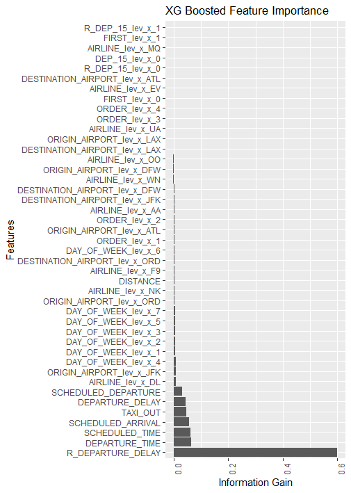

### 데이터마이닝 2019-2 프로젝트 결과 보고서

숙명여자대학교 경제학부,  
1614681 조유민

# 항공편 도착 지연 예측 
### *" 2015년 미국 조지아주 애틀랜타 국제공항 데이터에 기반한 분류 모델 "*

---

## Introduction

- What domain?
	- 항공 운송 산업

- What datamining problem? 
 	### Clssification
	- 항공편 도착이 지연될지의 여부를 예측하는 '분류' 문제  
		- 항공편의 항공사, 항공기, 노선, 예정 운항스케줄, 출발 시각 등을 알고 있을 때 제 시간에 도착할지를 예측하고자 한다.  
		(출발 이후의 시점에서 도착을 예측)

	- 지연에 따라 다양한 이해관계를 가진 당사자들 간 손익이 발생한다는 점에서 위 문제에 관심을 가질 만한 집단은 다음과 같다.

		1) 항공사와 공항 
		
			지연 예방을 위한 운항 스케줄 조정은 수익률과 기업 이미지에 큰 영향을 주는 사안 
		2) 항공편 구매 예정자와 실제 탑승객 
		
			일상생활과 밀접한 관련이 있고 금전 거래를 요하기 때문에 마찬가지로 민감한 사안 

		3) 관광업 종사자

			항공 운수 산업 외에도 그 밖의 다른 일정(숙박 및 편의시설, 여행 가이드, 식당, 박물관, 여행사, 렌트카 등) 또한 항공편과 연결되어 있기 때문에 전반적인 관광업계에서 반드시 고려해야 할 사안

	- 실생활의 편의를 돕기 위해서도 해결해야 할 문제 
	

- What data?

	- 항공편 운항 스케줄과 공항 및 항공사에 대한 정보를 가지고 있는 데이터가 필요
	- 2015년도 미국 국내선 항공 운항 스케줄과 공항 데이터를 사용 
	- 데이터셋을 샘플링함에 있어 노선 방향을 특정 공항으로 고정하는 방법은 [Chained Predictions of Flight Delay Using Machine Learning](https://www.researchgate.net/publication/330185077_Chained_Predictions_of_Flight_Delay_Using_Machine_Learning) 을 참고하였다. 또한 연결 항공편 지연에 특정 항공기가 중요한 영향을 미칠 것이라는 아이디어를 구체화하기 위해 2019 빅콘테스트 우수 수상작 발표 내용을 참고하여 파생변수를 생성하였다.  

	
 

- What key points?
	- 데이터셋 샘플링

		약 580만개 데이터를 모두 사용하는 것은 비효율적이기 때문에 샘플링을 진행하였다. 공항의 수가 상당히 많아 이를 모두 사용하지 않고 이용률이 높은 공항 5개 공항에 한해 분석하고자 하였다. 또한 출발 혹은 도착 공항을 ATL로 고정하였다. 이는 특정 항공기가 여러 공항을 거쳐 운항되기 때문에 이들 간의 네트워크를 파악하기 위해서는 노선 방향을 고정하는 것이 분석에 용이하기 때문이다.

	- 출발 지연 재정의

		주어진 Discription상 출발 시각은 비행기에 탑승한 시각이다. 하지만 실질적인 체감 출발 시각은 비행기가 이륙하는 시각이며 탑승과 이륙 사이의 시간이 도착 지연에 큰 영향을 미친다는 점을 고려하여 출발 지연 시간을 예정 출발 시각과 이륙 시각과의 차이로 재정의하였다. 이는 출발 지연을 보다 엄격하게 판단하는 것이며 도착 지연에 큰 영향을 미치는 두 변수를 조합하였기 때문에 더 큰 예측력을 가진다. 

	- 운항 스케줄 순서
	
		특정 항공기가 하루에 한 번씩만 운항되는 것이 아니기 때문에 출발 항공편이 어떤 항공기인지에 따라서도 지연율이 달라질 수 있다. 다만 항공기 식별 번호의 레벨 수가 약 2000개로 다소 연산이 부담스러운 변수이다. 따라서 항공편 지연 원인이 연결 항공편 지연이라는 점에서 착안하여 해당 항공편의 항공기가 몇 번째 운항 순번인지를 나타내는 파생변수를 생성하여 항공기 식별 번호만큼의 예측력을 보이는지를 살펴보고자 하였다. 이는 예측할 항공편의 항공기 식별 번호가 없는 상황에서도 해당 운항 스케줄을 고려하여 항공편을 식별할 수 있는 기준점이 된다. 

### ※ Why Arrival Delay?

	일반적으로 탑승객은 항공편 출발 지연에 관심을 갖기 때문에 1차적으로는 출발 지연 여부(DEP_15)를 타겟변수로 설정하였다. 그 결과, Accuracy가 1에 수렴할 정도로 예측력이 좋았지만 이는 사전에 알 수 없는 변수까지 모형에 적합했기 때문이었고 출발 이전의 시점에서 제공되는 변수만을 고려하여 다시 모형을 적합하였다. 하지만 출발 지연을 예측하기에는 변수가 부족할 것이라는 예상대로 성능은 매우 좋지 않았다. (F1-score가 0.3 미만) 

	예측 시점에서 알 수 있는 변수만을 사용해야 하는 것은 논리적으로 타당하다. 하지만 실제 상황에서는 기상 조건, 항공사와 공항 세부 정보, 노선의 특징 등 무수히 많은 요인들이 항공편 지연 여부에 영향을 미치는 데 반해, 분석에 사용한 데이터셋은 노선 이름, 항공사명 등의 단순하고 세밀하지 못한 정보를 제공하고 있다. 보다 정확한 예측을 목표로 한다면 주어진 데이터셋의 변수를 최대한 활용해야 했고 이에 따라 타겟변수를 출발 지연이 아닌 도착 지연으로 변경하였다. 

	한편, 대부분의 항공편 지연 원인이 연결 항공편 지연임을 감안하면 도착 지연 예측은 출발 지연 예측과도 밀접한 관련이 있다. 출발 지연이 도착 지연으로 이어지고 도착 지연이 출발 지연으로 이어지기 때문이다. 따라서 도착 지연 예측 문제가 출발 지연을 예측하고자 했던 초기 분석 목표에서 크게 벗어난 분석은 아니라는 점을 밝힌다.

---
## Background
- 항공편 번호 vs 항공기 번호 

	FLIGHT_NUMBER - 항공편 식별 번호 ex) 4822, 247, ... 

	TAIL_NUMBER - 항공기 식별 번호 ex) N547US, N17560, ...

- 이착륙 vs 출도착 

	- DEPARTURE_TIME(출발 시각) -> WHEELS_OFF(이륙 시각) -> AIR_TIME(비행 시간) -> WEELS_ON(착륙 시각) -> ARRIVAL_TIME(도착 시각)

		

	- TAXI_OUT = WHEELS_OFF - DEPARTURE_TIME

		탑승(DEPARTIRE_TIME) 시점부터 대기 지연 혹은 지상을 이동하여 이륙(WEELS_OFF)까지 걸린 시간
	- TAXI_IN = WHEELS_ON - ARRIVAL_TIME

		착륙(WHEELS_ON)한 시점부터 대기 지연 혹은 지상을 이동하여 하차(ARRIVAL_TIME)까지 걸린 시간
	- AIR_TIME(비행 시간)
	
		이륙 시점부터 착륙 시점까지의 시간

		
	
## Data

- [Kaggle: 2015 Flight Delays and Cancellations](https://www.kaggle.com/usdot/flight-delays) 에서 제공하는 데이터인 flights와 aiports를 사용함
- Raw data(flights)

	▶ 5819079 obs. of 31 variables

	

- 전처리 과정 (preprocessing)
	- 1차 변수 제거
		- 분석상 무의미함 - YEAR
		- 의미상 중복됨 - WHEELS_OFF, WHELLS_ON
		- 결측치 80% 이상 - CANCELLATION_REASON, AIR_SYSTEM_DELAY, SECURITY_DELAY, AIRLINE_DELAY, LATE_AIRCRAFT_DELAY, WEATHER_DELAY

	- 데이터 샘플링
		- 2015년 탑승객 수 기준 상위 5개 공항(ATL, LAX, ORD, DFW, JFK)을 오고 가는 항공편만 추출
		- 노선 방향은 ATL로 고정하여 모든 항공편은 ATL에서 출발하거나 ATL에 도착
		- IATA_CODE가 아닌 number로 표시된 공항은 IATA_CODE로 변경한 뒤 추출  
		ex) ATL - 10397

		출처  
		[DOT: Busiest US airports by total passenger boardings](https://en.wikipedia.org/wiki/List_of_the_busiest_airports_in_the_United_States)  
		[BTS: TranStats](https://www.transtats.bts.gov/DL_SelectFields.asp?Table_ID=236) 에서 OriginAirportID.csv_를 사용함 (DestAirportID.csv_와 동일한 데이터셋)

	- 결측치 처리
		- 출도착 관련 변수들의 결측치 비율이 대략 1.5~1.8%
		- 회항/결항은 지연과는 다른 Case이므로 filter out 필요 - DIVERTED, CANCELLED 제거
		- TAXI_OUT, TAXI_IN, ARRIVAL_DELAY에 결측치가 있는 항공편은 회항/결항
		- 회항/결항 항공편의 시간 관련 값들을 예측하는 것은 무의미하므로 결측치는 전부 제거

	- 이상치 처리 (수치형 변수)
		- TAXI_OUT, TAXI_IN 이상점 의심

			TAXI_OUT과 TAXI_IN이 60분 이상인 경우 대부분 그에 상응하는 도착 지연이 발생  
			TAXI_OUT과 TAXI_IN의 값이 상당함에도 도착 지연이 발생하지 않은 경우가 존재했으나 전부 비행 시간이 예정보다 단축되었던 경우에 해당함   
			따라서 이 값들을 이상치로 보지 않았고 TAXI_OUT과 TAXI_IN 모두 기존 변수 그대로 사용
			

			

		
	- 변수 정리(범주형 변수)
		- 샘플링으로 범주형 변수의 레벨이 줄어들었기 때문에 다시 범주화
		- DAY_OF_WEEK는 범주형 변수로 데이터 타입 변경

	- 파생변수 생성
		- 도착 지연 여부 - ARR_15 <타겟변수>  
		ex) ARRIVAL_DEALY가 15 미만이면 ARR_15는 0
		
		- 출발 지연 여부 - DEP_15  
		ex) DEPARTURE_DELAY가 15 이상이면 DEP_15는 1

		- 실제 출발 지연 시간 - R_DEPARTURE_DELAY = DEPARTURE_DELAY + TAXI_OUT

		- 출발 지연 체감 여부 - R_DEP_15  
		ex) R_DEPARTURE_DELAY가 15 이상이면 R_DEP_15는 1

		- 일별 특정 항공기의 운항 순번 - ORDER  
		ex) n월 n일 A 항공기의 3번째 운항스케줄에 해당하는 항공편의 ORDER는 3

		- 첫 운항 여부(ORDER가 1이면 1 아니면 0) - FIRST  

	- 2차 변수 제거
		- 예측 시점에서 알 수 없는 변수 - AIR_TIME, TAXI_IN, ARRIVAL_TIME, ARRIVAL_DELAY, ELAPSED_TIME(AIR_TIME + TAXI_OUT + TAXI_IN)
		- 분석상 무의미함 - DAY
	- 상관분석
		- SCHEDULED_TIME과 DISTANCE 간 높은 양의 상관관계

		

	
- Preprocessed data(flight) 

	▶  5819079 obs. of 31 variables → 45332 obs. of 19 variables
	
	

---

## Methods 

- 데이터셋 분할

	시계열 데이터이기 때문에 MONTH를 기준으로 약 7.5 : 2.5의 비율로 분할   
	1~9월은 train set, 10~12월은 test set

- 불균형 클래스 조정
	over, under, both, rose, smote의 5가지 sampling를 시도한 뒤 Random Forest 적합 후 F1-score를 기준으로 성능 비교 

  over     | under | both  |rose   | smote
  -------  | ----- | ------|-------|------
  0.745    | 0.577 | 0.723 | 0.630 | 0.643	
  ∴ over sampling 사용

- 최적 모형 선정을 위해 적합을 시도한 모형들
	- Random Forest(ranger)
		- mtry, num.trees
	- Decision Tree(C50)
		- control, trials, winnow
	- Tree Bagging(ipred)
		- nbagg, control
	- Boosting(adabag)
		- nbagg, mfinal, control
	- Boosting(xgboost)
		- nrounds, max_depth, lambda, eta, subsample, min_child_weight, colsample_bytree
		- 모델 적합 전에 one-hot encoding 필요함 

	- +) Support Vector Machine

## Results
#### 변수 선택 X

별도의 변수 선택 없이 초모수 세팅만을 시도한 결과이다. 

Method         | F1-score
-------------  | -------------
Decision Tree  |  0.768
Random Forest  |  0.776
Tree Bagging   |  0.777
Ada Boosting   |  0.763
xgboost        |  0.785
+) Support Vector machine |  0.950

#### 변수 선택
변수 중요도 확인이 가능한 Random Forest와 xgboost 모형에 한해 변수 선택을 진행해보았다. 

- Random Forest 

	Impurity를 기준으로 상대적으로 중요한 변수는 출발과 직접적인 연관이 있는 변수들과 항공기 식별 번호였다.
	상대적으로 중요도가 낮은 변수 ORDER, FIRST 등을 제거한 뒤 초모수를 세팅하여 적합해보았으나 성능은 오히려 감소하였다.  
	ORDER의 예측력을 알아보기 위해 TAIL_NUMBER을 제거하고 적합한 결과 ORDER의 중요도는 크게 변하지 않았지만 모형의 성능이 증가하였다.
	따라서 TAIL_NUMBER를 제거한 상황에서 여러 시도를 한 결과 FIRST를 추가로 제거하였을 때의 성능이 가장 좋았다.  
	TAIL_NUMBER와 FIRST를 추가로 제거한 최종 모형의 초모수와 변수 중요도는 다음과 같다. 
		
	 Hyper parameter         | value |  
	-------------  | -------- | 
	 mtry  |  2  |
	 num.trees |  1000  | 

	

- xgboost  

	Information Gain을 기준으로 상대적으로 중요한 변수는 Random Forest와 크게 다르지 않았으나 DEP_15의 중요도가 상당히 낮아졌다는 점에서 차이를 보였다. 거의 모든 TAIL_NUMBER의 가변수의 변수 중요도가 낮아 이를 제거한 뒤 초모수를 세팅하여 적합하자 성능이 조금 증가하였으며 추가적으로 DEP_15와 R_DEP_15, FIRST를 각각 제거해 보았으나 성능 개선이 이루어지지 않았다. 
	TAIL_NUMBER를 제거한 최종 모형의 초모수와 변수 중요도는 다음과 같다.

		

	 Hyper parameter         | value |  
	-------------  | -------- | 
	 nrounds  |  377  |
	 max_depth |  9  | 
	 lambda   |  0.997603  |
	 eta   |  0.1133466  |
	 subsample        | 0.6029375  |
	 min_child_weight | 1.098031
	 colsample_bytree | 0.9077054

	

- Good? 

	R_DEPARTURE_DELAY
	두 모형을 기준으로 변수 중요도를 살펴보았을 때 같은 출발 지연 관련 변수임에도 xgboost에서는 상대적으로 중요도가 낮았던 DEPARTURE_DELAY와 달리 R_DEPARTURE_DELAY는 두 모형에서 모두 가장 중요한 변수에 해당하였다. 그 외의 출발 관련 변수, 예정 시간 변수는 순위나 중요도에 있어서는 차이를 보였으나 공항, 항공사 등의 변수에 비해 대체적으로 변수 중요도가 높았다. 

- Bad? 

	TAIL_NUMBER, ORDER
	TAIL_NUMBER를 대체할만한 변수로 생성했던 ORDER나 FIRST의 경우 TAIL_NUMBER 포함 여부에 관계없이 중요도가 매우 낮았다. 이는 일부 공항의 항공편만을 샘플링해 사실상 ORDER가 모든 운항 스케줄의 순번에 대한 정보를 포함하고 있지 않기 때문인 것으로 보인다. 만약 모든 공항의 운항 스케줄을 사용하여 ORDER의 레벨 수를 증가시킨다면 변수 중요도가 높아질 것으로 기대된다.  

- 최종 모형 후보군

	 Method        | F1-score |  F1-score
	-------------  | --------  | ----------
	 Random Forest  |  0.776  | 0.809
	 xgboost        |  0.785  | 0.793
	 +) Support Vector machine |  0.950

- Confusion Matrix

	< xgboost >        
	* | 0  | 1   
	---| ----- | --- 
	0  |  9428 |  172    
	1 |  519  | 1327  

	< Random Forest >
 	 * | 0  | 1   
	---| ----- | --- 
	 0  |  9274 | 326    
	 1 |  371  | 1475 

	< Support Vector Machine >
 	 * | 0  | 1   
	---| ----- | --- 
	 0  |  8986 | 335    
	 1 |  614  | 1511  

## Concluding remarks

	- 분석 데이터
	해당 항공편이 출발한 시점에서 도착 지연 여부를 예측하는 것이 주요한 목적으로 1월부터 9월까지의 데이터로 학습한 모델을 이용해 10월부터 12월의 항공편 도착 지연을 예측하였다. 원본 데이터를 그대로 사용하면 연산 속도의 효율이 떨어지기 때문에 항공편의 범위를 다음과 같이 제한하였다. 
	시간적 범위는 2015년 1~9월이며, 공간적 범위는 ATL 공항을 출발 혹은 도착으로 하되 탑승객 수 기준 상위 공항(LAX, ORD, DFW, JFK)을 오가는 항공편이다. 

	- 분석 결과
	가장 높은 성능을 보인 최종 모형은 Support Vector Machine으로 F1-score가 대략 0.95였다. 

	- ATL 공항의 최적 모형
	ATL 공항에서 출발하거나 도착하는 항공편만을 샘플링하여 학습했기 때문에 최적 모형은 ATL 공항 맞춤 모형으로 볼 수 있다. 만약 다른 공항을 기준으로 방향을 고정한다면 공항별로 모델링이 가능할 것이다. 

	
	

	

- Future works
	- 세밀한 Hyper parameter 조정 ex) grid search, random search
	- ORDER의 정보 손실 개선
	- 다른 공항 기준으로 샘플링하여 공항별 모델링 시도
	- 최소 2개년치 데이터를 사용하여 MONTH를 feature로 사용
	- 가장 붐비는 노선에 관한 파생변수 생성

	