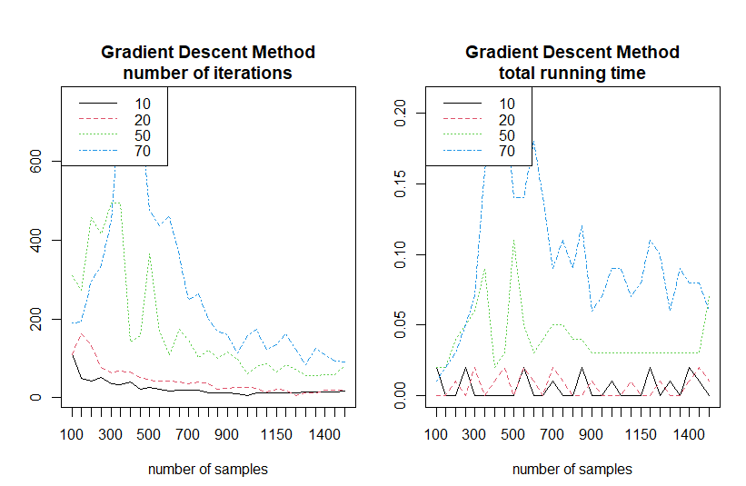
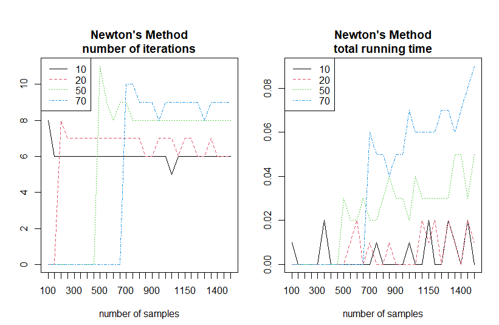

# Side Project
교내 프로젝트 및 스터디 활동 내용을 정리하는 공간

---
### [ML/DL] [OWOP(One Week One Paper)](https://github.com/rbill109/SideProject/tree/main/OWOP)
- 다양한 ML, DL 알고리즘 관련 논문을 리뷰하는 스터디

### [DL] [네카라쿠](https://github.com/rbill109/SideProject/tree/main/Project_Study/Nakalacou_2021)
Anomaly Detection, RecSys 등 다양한 딥러닝 알고리즘을 공부하고 구현하는 스터디
- [기계시설물 고장예지센서 이상 탐지](https://github.com/rbill109/SideProject/tree/main/Project_Study/Nakalacou_2021/Anomaly_Detection)
- [MovieLens 영화 추천(진행 중)](https://github.com/rbill109/SideProject/tree/main/Project_Study/Nakalacou_2021/RecSys)

---

### [ML/Visualization] 교내 프로젝트
- [대출 상환 여부 예측](https://github.com/rbill109/SideProject/blob/main/Project_Study/StatAP_2019)
- [항공편 도착 지연 예측](https://github.com/rbill109/SideProject/blob/main/Project_Study/DataMining_2019)
- [Steam 기반 ESD 서비스 신규 웹페이지 제안](https://github.com/rbill109/SideProject/tree/main/Visualization)

---

### [ML] [The Elements of Statistical Learning](https://web.stanford.edu/~hastie/ElemStatLearn/)을 참고하여 아래 알고리즘을 구현
#### 통계 분석 모듈 - [Mini_ML.py](https://github.com/rbill109/SideProject/tree/main/Code_Implementation/module)
- Linear regression
- Linear Regression of an Indicator
- Linear discriminant analysis
- Quadratic discriminant analysis
- Logistic regression
- Kernel density estimation

#### [Gamma Kernel을 사용한 KDE](https://link.springer.com/article/10.1023/A:1004165218295) 구현
- [Gamma kernel density estimation](https://github.com/rbill109/SideProject/blob/main/Code_Implementation/Gamma_kernel_density_estimation.ipynb)

### [DL] [Deep Learning Architectures](https://link.springer.com/book/10.1007/978-3-030-36721-3)을 참고하여 아래 알고리즘을 구현
- [Gradient Descent, Newton's Method](https://github.com/rbill109/SideProject/blob/main/Code_Implementation/Gradient_Descent_and_Newton's.R)

- [One-hidden layer Neural Network](https://github.com/rbill109/SideProject/blob/main/Code_Implementation/One_hidden_layer_NN.R) 

- [L2-Regularization](https://github.com/rbill109/SideProject/blob/main/Code_Implementation/L2_regularization.R)

