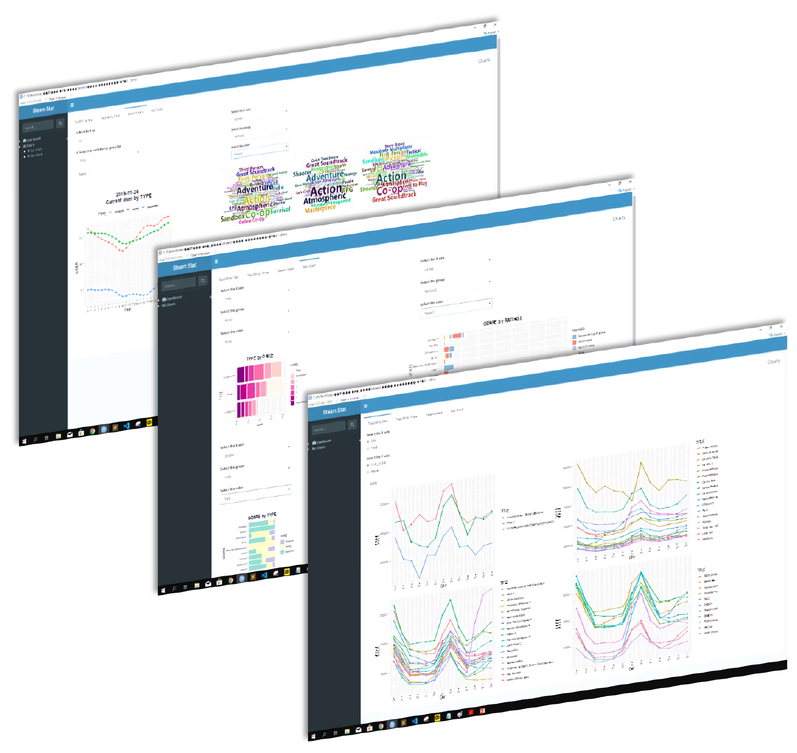

# Steam 기반 ESD 서비스 웹페이지 모델링
2019-2 [통계데이터베이스] 기말 프로젝트 제출작

## Goal 
#### **자유주제**  
Web Scraping을 바탕으로 한 DB 구축 및 데이터 분석

### Overview
게임 ESD 서비스 플랫폼인 Steam의 웹페이지 개선  

**[Problem]**  
한정적인 통계 데이터만을 제공하는 Steam Stats 페이지

**[Solution]**  
신규 유저들의 게임 구매와 게임 개발자들의 시장분석을 돕기 위해 가격대, 할인율 등 다양한 범주에 따른 **게임 정보를 시각화**하는 웹페이지 제안

**[Key point]**
- 사이트 내 게임 정보를 실시간으로 크롤링한 뒤 Linux ssh를 사용하여 mysql DB에 저장
- 실시간 인기와 판매량을 고려하여 게임을 3가지 타입(Longrun, Rising, Topseller)으로 분류
- 가격, 장르, 타입 등의 feature에 따른 인기도 분석 결과를 R Shiny로 동적 대시보드 구현

- - -

### Timeline
2019.09 ~ 2019.12

### Presentation
[발표 자료](통계데이터베이스_최종발표.pdf)
